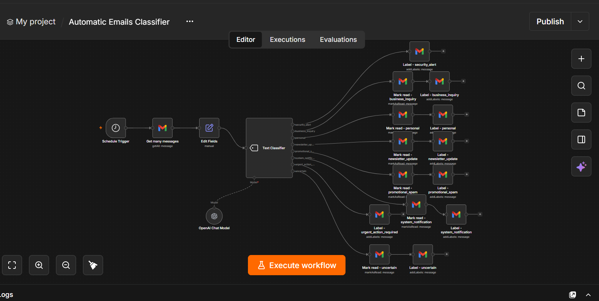
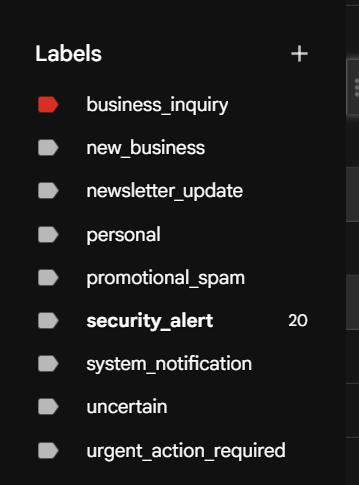

# 📧 Automatic Emails Classifier — n8n Workflow

An intelligent email management workflow built with n8n that automatically reads your Gmail inbox every 3 hours, classifies each email into one of 8 smart categories using OpenAI GPT-4o-mini, and applies the correct Gmail label — fully automated, zero manual effort.

---

## What It Does

```
Gmail Inbox (every 3 hours)
        ↓
  Fetch Unread Emails
        ↓
  Extract Subject + Sender + Snippet
        ↓
  AI Classifier (GPT-4o-mini)
        ↓
┌──────────────────────────────────────┐
│  Apply Label + Mark as Read          │
│  per category                        │
└──────────────────────────────────────┘
```

**No manual sorting. No missed emails. Zero errors.**

---

## 🏷️ Categories Classified Automatically

| Category | Description |
|---|---|
| `security_alert` | Sign-in alerts, password resets, 2FA codes |
| `business_inquiry` | Client messages, leads, project discussions |
| `personal` | Messages from friends or family |
| `newsletter_update` | Subscribed blogs, product updates, digests |
| `promotional_spam` | Marketing, ads, unsolicited sales emails |
| `system_notification` | Bounce reports, bot confirmations, errors |
| `urgent_action_required` | Deadlines, payment dues, approvals needed |
| `uncertain` | Too ambiguous to classify confidently |

---

## ⚙️ Tech Stack

| Tool | Purpose |
|---|---|
| n8n | Workflow automation engine |
| OpenAI GPT-4o-mini | AI-powered email classification |
| Gmail (OAuth2) | Email fetching + labeling |

---

## 🔄 Workflow Overview

```
[Schedule Trigger] → [Gmail: Fetch Emails] → [Edit Fields] → [Text Classifier (AI)]
                                                                        ↓
                                          [Label + Mark Read per category] × 8
```

**19 nodes. Fully automated. Runs every 3 hours, 24/7.**

---

## 🚀 Setup

### 1. Import Workflow

Open n8n → **Import from file** → select `workflow.json`

### 2. Add Credentials

| Credential | Where to Get |
|---|---|
| OpenAI API Key | [platform.openai.com](https://platform.openai.com) |
| Gmail OAuth2 | [Google Cloud Console](https://console.cloud.google.com) |

### 3. Create Gmail Labels

In your Gmail account, create these labels manually (or they will be applied as new):

```
security_alert
business_inquiry
personal
newsletter_update
promotional_spam
system_notification
urgent_action_required
uncertain
```

### 4. Update Label IDs in Nodes

- Open each **"Label - ..."** node
- Replace the `labelIds` with the actual Label IDs from your Gmail
- You can get Label IDs from Gmail API or Google Cloud Console

### 5. Activate

Toggle the workflow **Active** in n8n — it will run automatically every 3 hours.

---

## 📸 Screenshots

### Workflow Overview


### Email Labeled in Gmail


---

## 🎬 Demo Video

Demo Video is available on LinkedIn:
[Watch Here](#) *(add your LinkedIn post link)*

---

## 💡 Use Cases

- **Freelancers** — never miss a client inquiry buried under spam
- **Small businesses** — auto-sort vendor and customer emails
- **Developers** — get security alerts separated from newsletters instantly
- **Anyone** — take back control of a cluttered inbox, fully automated

---

## 🛠️ Customization Ideas

- Add a **Slack notification** for `urgent_action_required` emails
- Auto-reply to `business_inquiry` with an acknowledgement
- Log classified emails to **Google Sheets** for tracking
- Add more categories by editing the Text Classifier node

---

## 📄 License

MIT — free to use and modify.

---

## 👤 Author

Built by **[Your Name]** — n8n & AI Automation Specialist  
📧 your@email.com  
🔗 [LinkedIn](#) | [GitHub](#)
